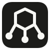

<p align="center">
  
</p>

<h1 align="center">VC Workspace</h1>

VC Workspace 是构建在 Proxmox VE 之上的开源虚拟桌面平台。当前 MVP 支持本地/OIDC 身份、用户与 AI Agent 的显式桌面分配、真实 PVE 桌面生命周期、Guest 本地权限策略、macOS 原生客户端与 FreeRDP 数据面，以及带独占桌面租约的 MCP 服务。

项目公开仓库将发布在 [Veritas-Calculus/vc-workspace](https://github.com/Veritas-Calculus/vc-workspace)。首次 push 前，该地址只作为项目的固定源码入口，不展示虚构的版本、Star 或 Release 状态。

## 当前状态

面向人的核心 MVP 已形成闭环：管理员可以管理真实 PVE 桌面、分配用户与 Agent、控制 Guest 本地权限并查询审计；用户可以从签名的 macOS 客户端进入 Debian 13 或 Windows 桌面。项目仍处于发布前补齐阶段，MCP Computer Use、会话管控、Web 模板实建、Windows GVT-g、真实 OIDC、Kubernetes 实集群部署和开源发布尚未全部完成。

当前状态、优先级与 TODO 统一维护在 [项目状态与 TODO](docs/plan/status.md)；里程碑和实机证据见 [MVP 开发计划](docs/plan/mvp.md)，其他架构、UI 与运维约束从 [文档索引](docs/README.md) 进入。

## 技术栈

- 控制面与 MCP：Go
- Web 管理端：TypeScript、React、Vite
- 数据库：PostgreSQL
- 会话核心与 Guest Agent：Rust
- macOS 客户端：SwiftUI/AppKit；FreeRDP 原生 `NSView` 数据面随 `.app` 一起分发

Rust 不进入首个控制面纵向切片。只有 Guest Agent、协议和跨平台会话核心需要它，避免在 CRUD、认证和 PVE 编排上维护两套服务端运行时。

## 仓库结构

```text
apps/
  control-plane/    Go API、认证、Broker 与 PVE Reconciler
  mcp/              面向 AI Agent 的 MCP 服务
  web/              Web 管理端与用户入口
clients/
  macos/            Tier 1 原生客户端
  windows/          后续客户端
  linux/            后续客户端
crates/
  session-core/     跨平台会话核心
  guest-agent/      Windows/Linux Guest Agent
internal/           Go 模块化单体内部包
api/                OpenAPI 契约
assets/brand/       官方标志、应用图标与发布源文件
deploy/             Compose、Cloud-Init 与 Packer OS 模板
docs/               当前有效的产品、架构、设计与运维文档
```

## 本地开发

前置依赖：Go 1.27、Rust 1.85、Node.js 22、pnpm 10、Docker。构建 PVE OS 模板时另需 Packer 1.15 与 Proxmox 插件 1.2.4。

```bash
cp .env.example .env
docker compose -f deploy/compose.yaml up -d postgres
pnpm install
pnpm dev
```

控制面默认监听 `127.0.0.1:8080`，Web 默认监听 `127.0.0.1:5173`。Web 根路径 `/` 是开源项目 Landing Page，管理端从 `/console` 进入。PVE 凭证只通过环境变量或宿主机凭证文件提供，禁止提交到 Git。

服务端可以通过 `deploy/container/` 中的三个非特权容器镜像和 `deploy/kubernetes/base/` 的 Kustomize 清单部署到 Kubernetes；外部 HTTPS、集群内端口、PVE、MCP 与 RDP 数据面边界见 [Kubernetes 部署](docs/operations/kubernetes.md)。

构建 macOS 客户端需要 CMake 和 Ninja；最终用户不需要安装 Homebrew、OpenSSL 或 FreeRDP。运行 `make macos-app` 会下载并校验固定版本的 FreeRDP 与 OpenSSL LTS 源码，面向 macOS 14 构建原生数据面，再把桥接层、运行库、证书对话框和官方应用图标一并签入 `clients/macos/.build/app/VC Workspace.app`。如更新 1024px 品牌源图，运行 `clients/macos/scripts/build-app-icon.sh` 可重复生成 ICNS。产物包含系统可识别的 Bundle ID 和 `vc-vdi://` OIDC/App Link 注册，Web 可用 `vc-vdi://connect?vmid=<VMID>` 打开当前控制面中的授权桌面。真实验收不使用裸 `swift run` 代替。MCP 启动方式见 `apps/mcp/README.md`。

## 文档维护规则

- `docs/plan/status.md` 是当前进度和 TODO 的唯一来源；`docs/plan/mvp.md` 保存里程碑退出条件与验收证据。
- `docs/architecture/` 只描述当前采用的系统，不保留已否决方案的长篇副本。
- 被替代的决定在 ADR 中标记 `Superseded`，不复制一份“新版说明”。
- 每个功能变更必须在同一提交中更新对应文档和 OpenAPI。
