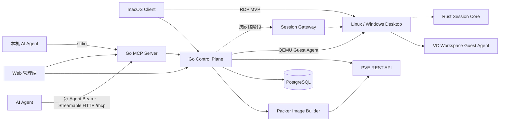

# 系统架构

## 定位

VC Workspace 是 PVE 之上的 VDI Broker，不替代 PVE，也不把 PVE 控制台包装成最终用户桌面。PVE 负责虚拟化和存储；VC Workspace 负责身份、桌面池、分配、会话、策略、AI Lease 与用户体验。

## 组件边界

- `control-plane`：模块化单体。拥有身份、桌面、PVE Adapter、任务与审计。
- `web`：管理员与用户共用的浏览器入口，服务端 Cookie Session，不保存 OIDC Refresh Token。
- `mcp`：独立进程，只调用控制面授权 API，不读取 PVE 凭证；本机 `stdio` 在启动时验证一个 Agent 凭证，Kubernetes 的无状态 Streamable HTTP `/mcp` 在每个请求上验证调用方自己的 Agent 凭证。
- `session-core`：保留跨平台协议、重连和遥测边界；首个 macOS 切片直接调用 FreeRDP 3。
- `image builder`：控制面只把经过校验的参数交给仓库内固定允许列表的 Packer 定义，从受许可 ISO 构建 Debian 13、Windows 10/11 PVE 模板；浏览器不能提交任意命令或模板路径。构建密码和产品密钥只存在于单次请求与子进程环境，不进入数据库、Job、审计详情或命令行。
- `guest-agent`：Rust 跨平台进程写入心跳、OS 清单和本机 RDP 就绪状态；QEMU Guest Agent 是控制面读取状态、发现 IP 和轮换本地用户密码的宿主通道。
- 原生客户端：每个平台保留自己的 UI、输入、密钥存储和渲染层。

## MVP 数据流

1. 管理员通过一次性 Setup Token 创建首个本地管理员。
2. 管理员配置 PVE 或由部署环境注入 PVE 凭证。
3. 控制面读取节点、存储、VM 与模板，规范化为内部模型。
4. 管理员选择模板创建 Personal Persistent 桌面；完成的 `vc-vdi` VM 写入桌面注册表，也可从实时 PVE 清单显式同步。
5. 管理员把桌面分别分配给用户或 Agent。两类分配使用独立关系表，不允许通过 PVE 名称、客户端筛选或 MCP 工具参数绕过。
6. 控制面写入幂等 Job，再调用 PVE Clone，持久化 UPID；后台任务独立于浏览器轮询完成状态收敛，并在需要时配置 PCI Resource Mapping。
7. AI Agent 用独立凭证接入 MCP，只能列出被分配的桌面，并在领取独占、限时 Lease 后执行电源动作。停用 Agent 或移除分配会吊销活动租约。
8. macOS 客户端只读取当前用户的分配，启动桌面并在运行后请求 RDP 描述符；禁用用户会撤销 Web 和 Native Session。
9. 控制面读取 Guest IP，通过 QEMU Guest Agent 把版本化的本地权限策略收敛到 `vdi`，未应用则拒绝建联；随后轮换密码并返回不可缓存的描述符。客户端把描述符交给进程内 FreeRDP Bridge，并在自身 AppKit `NSView` 中呈现会话。
10. 控制面把身份、分配、配置、桌面、任务、连接和 AI Lease 的安全相关结果追加到审计表；管理员通过游标接口查询，敏感字段在持久化前统一脱敏。

Web 可以用 `vc-vdi://connect?vmid=<正整数>` 把一台桌面交给已安装的 macOS 客户端。该 App Link 只是本机导航意图，不是授权或连接票据：链接不携带服务器、Session、密码、Guest 地址或 RDP 描述符；客户端继续使用 Keychain 中与当前控制面绑定的 Session，重新获取可见桌面后才执行已有的启动与建联流程。冷启动或未登录时只缓存一个待处理 VMID，登录成功后再校验和消费。Universal Links 留到项目拥有稳定 HTTPS 域名、Apple Associated Domains 签名和站点关联文件后实现。

## 镜像与 GPU

- `image_profiles` 是 Debian 13 XFCE、Windows 10 和 Windows 11 的当前配置事实源，包含 PVE 构建节点、ISO、VirtIO ISO、模板 VMID、镜像源、CPU/内存/系统盘、固件/TPM、Agent 类型、默认 GPU 档位和构建状态。
- 构建流水线输出不可变 PVE 模板。Windows 构建先安装 VirtIO、QEMU Guest Agent、Cloudbase-Init 与 VC Workspace Agent，再执行 Sysprep `/generalize`；Debian 构建使用 `10.31.0.2` 软件源并执行 `cloud-init clean`。
- Web Bootstrap 保存构建参数后创建 `image.build` Job。启动前控制面实时校验节点在线、存储可用、目标 VMID 未占用，并限制同一镜像只能存在一个活动构建；Packer 输出被脱敏后收敛为进度。成功只把镜像置为 `testing`，避免未经克隆和 RDP 验收的模板进入桌面创建入口。
- `gpu_profiles` 表达调度约束，不直接等价于“硬件可用”。完整直通要求映射、目标节点、设备 ID、Vendor/Class 与有效 IOMMU group 全部匹配；mdev 要求映射标记为 mediated、目标节点实时暴露指定 `mdev_type` 且 `available > 0`。
- PCI Resource Mapping 的创建和更新也由控制面承担：请求只提交逻辑 ID、模式与节点/PCI 地址，硬件 Vendor/Device ID、IOMMU group 和 mdev 能力必须从实时 PVE 清单解析，浏览器不能自行声明这些可信属性。
- Intel HD 530 首个共享路径采用 GVT-g。控制面读取 `/nodes/{node}/hardware/pci/{bdf}/mdev`，为 PVE 映射写入 `mdev=1`，克隆完成后写入 `hostpci0=mapping=<id>,mdev=<type>`；GVT-g mdev 不声明 `x-vga`，也不强制 `pcie=1`，以兼容现有 i440fx Linux 模板。档位按实时剩余实例调度，禁止在线迁移；完整 PCI passthrough 继续作为独占路径并保持 IOMMU/VFIO 门禁，独显复用完整直通模型。

首个数据面要求客户端网络可直达 Guest 的 3389/TCP。跨网段部署将增加 Session Gateway 和短期票据；PVE VNC/SPICE 仅用于运维诊断，不是最终用户桌面。

## 技术原则

- 只使用 PVE REST API，不修改 `/etc/pve` 或内部数据库。
- 所有 PVE 写操作异步、幂等、可对账；PVE VMID 是外部标识，内部 UUID 是主键。
- 控制面先保持模块化单体；Gateway 与 MCP 因信任和流量边界独立部署。
- Kubernetes 对外只暴露一个 HTTPS 入口：Web 同源代理 `/api/` 与 `/mcp`，控制面、MCP Service 和 PostgreSQL 都保持 ClusterIP；逐 Agent 签发的外部凭证与控制面内部服务 Token 分离。
- RDP 是首个数据面。macOS 客户端通过仓库内 C ABI Bridge 加载随 `.app` 分发的 FreeRDP 3 原生客户端，将 `MRDPView` 嵌入 SwiftUI/AppKit 会话页；不会启动或聚焦另一个 RDP 应用。交互客户端使用单一自适应档位，由 FreeRDP 处理网络检测、压缩、编解码缓存、渐进式 GFX和有界自动重连；带宽特化参数仅保留给管理策略和诊断，不向普通用户展示。更高性能串流仍保留在后续协议评估中。
- 模板和 GPU 配置通过控制面管理；Packer 构建器只持有最小权限构建 Token，运行时控制面不保存 Windows 构建密码。
- OpenAPI 是 Web、客户端和 MCP 的唯一 HTTP 契约。
